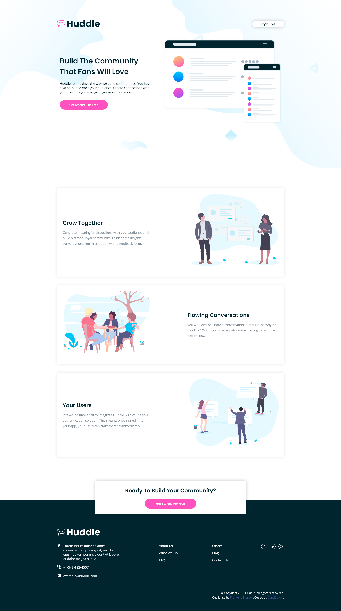

# Frontend Mentor - Huddle landing page with alternating feature blocks

Thanks for checking out my solution to this [front-end coding challenge](https://www.frontendmentor.io/challenges/huddle-landing-page-with-alternating-feature-blocks-5ca5f5981e82137ec91a5100).

## Table of contents

- [Overview](#overview)
  - [The challenge](#the-challenge)
  - [Screenshot](#screenshot)
  - [Links](#links)
- [My process](#my-process)
  - [Built with](#built-with)
- [Author](#author)

## Overview

This took longer than i expected. I spent about 12 hours on this, and it was fun. At the end, I learned that I should have probably divide parts and components of the sites.

### The challenge

Your challenge is to build out this landing page and get it looking as close to the design as possible.

You can use any tools you like to help you complete the challenge. So if you've got something you'd like to practice, feel free to give it a go.

Your users should be able to:

- View the optimal layout for the site depending on their device's screen size
- See hover states for all interactive elements on the page

### Screenshot

### Links

- Solution URL: [On Frontend Mentor](https://www.frontendmentor.io/solutions/huddle-landing-page-with-single-introductory-section-html-and-scss-SeQI5kdHw)
- Live Site URL: [Live Demo](https://captkraken.github.io/huddle-landing-page-with-alternating-feature-blocks/)

## My process

Started out with HTML then went the mobile-first route. After that, started modifying things to fix the problems.

### Built with

- HTML5
- Sass
- CSS Flexbox

## Author

- Website - [My Github](https://github.com/CaptKraken)
- Frontend Mentor - [@CaptKraken](https://www.frontendmentor.io/profile/CaptKraken)
